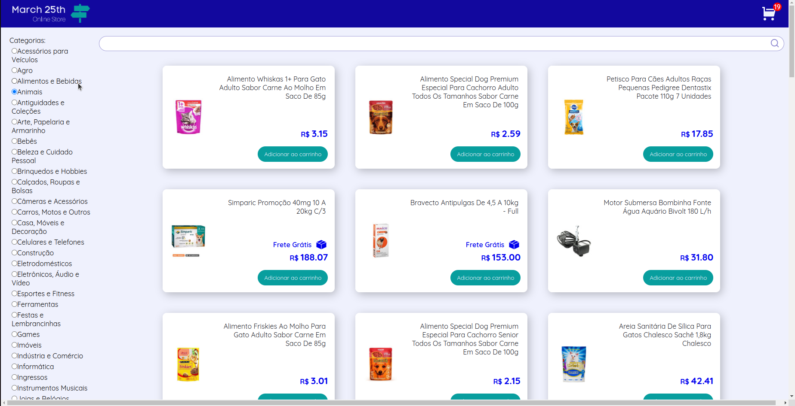

### Projeto de Front-End Online Store!

## Descrição

Projeto desenvolvido por [Júlia Domenciano](https://github.com/juliadomenciano), [Lazaro Andriola](https://github.com/lazaroor), [Raphael Martins](https://www.linkedin.com/in/raphaelameidamartins/), [Leo Begnossi](https://github.com/MadOrchid) e [Thamires Aparecida](https://github.com/thamiresl) durante o curso de desenvolvimento de software da Trybe.
Este projeto é uma versão simplificada de uma **loja online**, desenvolvida e implementando funcionalidades de acordo com demandas definidas em um quadro _Kanban_. A partir dessas demandas, criamos uma aplicação onde os usuários podem:
  - Buscar produtos por termos e categorias a partir da _API do Mercado Livre_;
  - Interagir com os produtos buscados de modo a adicioná-los e removê-los de um carrinho de compras em diferentes quantidades;
  - Visualizar detalhes e avaliações prévias de um produto, bem como criar novas avaliações;
  - E por fim, finalizar a compra (simulada) dos itens selecionados.

### Observação

  Este projeto está em desenvolvimento.

### Em andamento

  - [ ] CSS;
  - [ ] Refatoração.

## Ferramentas

  * React

# Habilidades Desenvolvidas

* Entender o que são Métodos Ágeis
* Entender o que é Kanban
* Entender o que é Scrum
* Trabalhar em equipes utilizando Kanban ou Scrum de maneira eficaz
* Praticar todas as habilidades desenvolvidas até agora no módulo de Front-End
